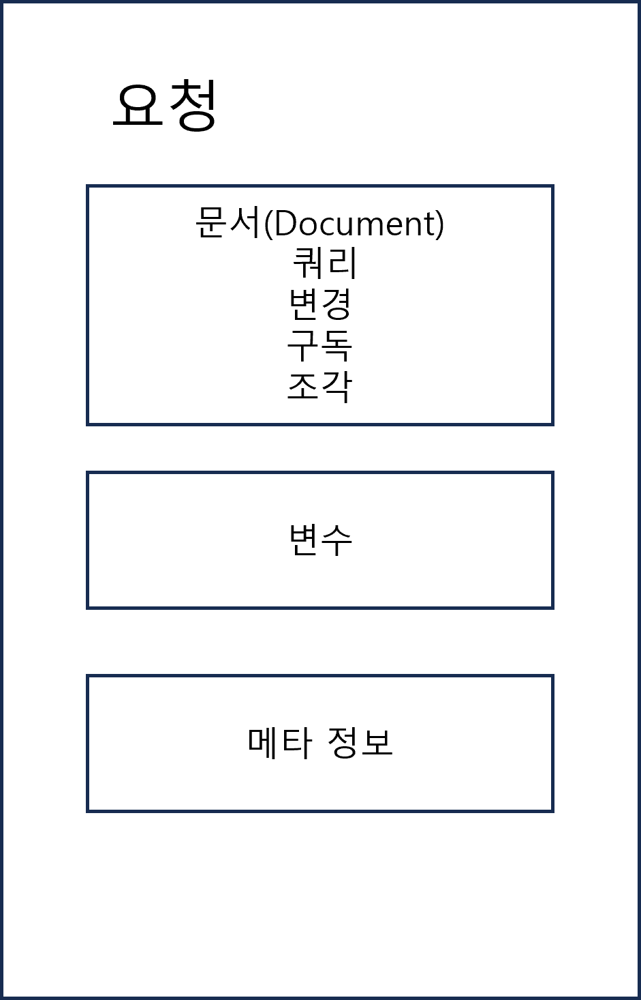

# 그래피컬 (GraphiQL)

- 문서, 자동완성 지원
- ex. https://graphql.org/swapi-graphql

# GraphQL 언어

## 요청

문서(document)라고도 불린다.  
query: 읽기 전용  
mutation: 데이터 변경 후 읽기  
subscription: 데이터 구독 (변경되면 실시간으로 변경 내용을 받는다.) - 데이터 폴링보다 효율적이다.
fragment 요청이 있다.  
변수 / 처리와 관련된 메타 정보도 포함될 수 있다.



```GraphQL
query GetEmployees($active: Boolean!) {
    allEmployees(active: $active) {
        ..employeeInfo
    }
}

query FindEmployees {
    employees(id: $employeeId) {
        ..employeeInfo
    }
}

fragment employeeInfo on Employee {
    name
    email
    startDate
}

mutation RateStory {
    addRating(storyId: 123, rating: 5) {
        story {
            averageRating
        }
    }
}

subscription StoriesRating {
    allStories {
        id
        averageRating
    }
}
```

```
// variables
{
    "active": true,
    "employeeId": 42
}
```

## 필드

항상 선택 세트(중괄호 안의 내용)내에 포함되어야 한다.  
추출해야 할 객체의 개별 정보 단위를 기술한 것  
스칼라값(Int, String, Float, Boolean), 객체, 리스트를 기술할 수 있다.

- 필드의 마지막 중첩 단계에서는 스칼라 값을 기술한 필드만 가질 수 있다.  
  ex. friends필드의 선택 세트 { name }을 지정하지 않으면 에러가 발생한다.

```GraphQL
# 주석
{
    me {
        email
        birthday {
            month
            year
        }
        friends {
            name
        }
    }
}
```

## 내향성 쿼리

내향성 쿼리를 제공해서 API 스키마에 대한 정보를 공개한다.  
그래피컬의 자동 완성 목록은 내향성 쿼리를 기반으로 한다.  
두 개의 밑줄(**)로 시작하는 것은 내향성용으로 지정된 예약어이다.  
ex. **type / **schema, **typename
